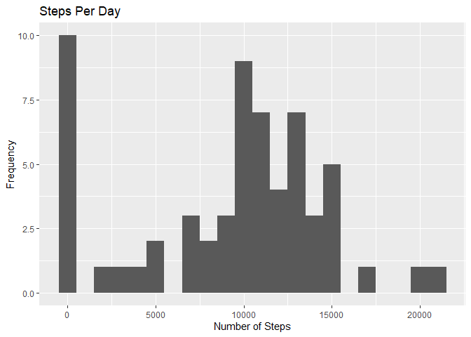
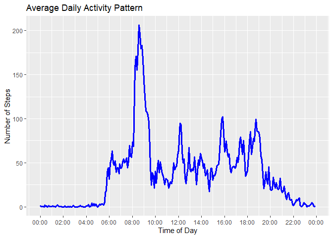
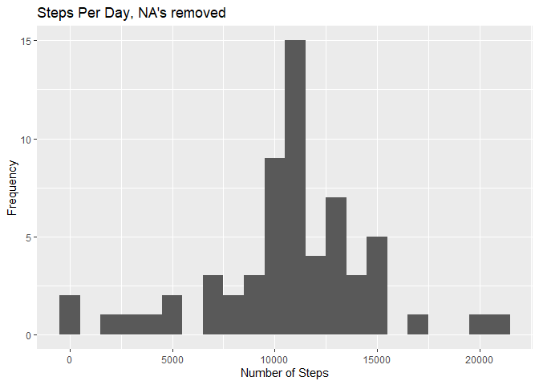
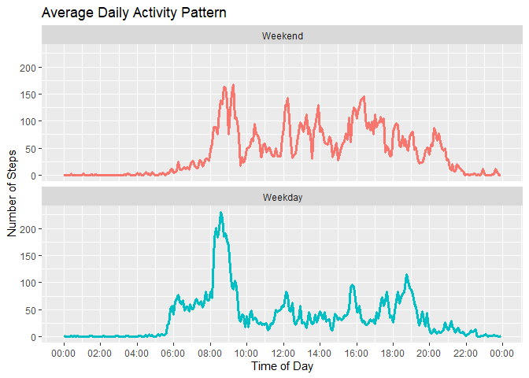

```r
library(dplyr)
```

```
## 
## Attaching package: 'dplyr'
```

```
## The following objects are masked from 'package:stats':
## 
##     filter, lag
```

```
## The following objects are masked from 'package:base':
## 
##     intersect, setdiff, setequal, union
```

```r
library(ggplot2)
library(knitr)
library(lubridate)
```

```
## 
## Attaching package: 'lubridate'
```

```
## The following objects are masked from 'package:base':
## 
##     date, intersect, setdiff, union
```

```r
library(stringr)
library(scales)
opts_chunk$set(echo=TRUE)
options(digits = 2)
```

## Loading and preprocessing the data
Open the zip file "activity.zip" and read it into the data frame "data".  
Next, change the "date" variable from character to date type, and convert the "interval" to a time, as "time", by converting the interval value to a 4 digit string, splitting it up and converting it using the "hm" function form lubridate.


```r
data <- read.table(unz("activity.zip","activity.csv"),header=TRUE,sep=",")
data <- data %>% mutate(date=as.Date(date,format="%Y-%m-%d"))
temp <- str_pad(data$interval,width=4,pad="0")
data <- data %>% mutate(time=as.POSIXct(paste(substr(temp,1,2),substr(temp,3,4),sep=":"),format="%H:%M"),tz="America/Chicago")
```

## What is mean total number of steps taken per day?
Group steps by day, then sum up all steps, saving it in the variable "TotalSteps".  
This variable is then displayed in a histogram, with a bin width of 1000 steps.


```r
stepsPerDay <- data %>% group_by(date) %>% summarize(TotalSteps=sum(steps, na.rm=TRUE))
```

```
## `summarise()` ungrouping output (override with `.groups` argument)
```

```r
stepsPerDay %>% ggplot(aes(TotalSteps)) + geom_histogram(binwidth=1000) + ggtitle("Steps Per Day") + 
  xlab("Number of Steps") + ylab("Frequency")
```

<!-- -->

```r
meanSteps <- mean(stepsPerDay$TotalSteps)
medianSteps <- median(stepsPerDay$TotalSteps)
```

The mean of the steps per day is 9354.23, and the median is 10395.

## What is the average daily activity pattern?

Group steps by interval, the calculate the average number of steps per interval.


```r
dailySteps <- data %>% group_by(time) %>% summarize(steps=mean(steps, na.rm=TRUE))
```

```
## `summarise()` ungrouping output (override with `.groups` argument)
```

```r
dailySteps %>% ggplot(aes(time,steps))+geom_line(size=1.2,color="blue") + 
  scale_x_datetime(breaks=breaks_width("2 hours"),labels=date_format("%H:%M",tz="America/Chicago")) +
  ggtitle("Average Daily Activity Pattern") + xlab("Time of Day") + ylab("Number of Steps")
```

<!-- -->

```r
maxInterval <- which.max(dailySteps$steps)
maxTime <- format(dailySteps$time[maxInterval],"%H:%M")
```

The interval with the maximum number of steps is interval 104, which starts at 08:35.

## Imputing missing values


```r
steps_na <- is.na(data$steps)
countNA <- sum(steps_na)
```

The data set has 2304 "NA"s in the "steps" variable.  
Replace all NAs in steps with average # of steps for this interval.  

```r
fixedData <- data
for (i in seq_len(nrow(fixedData))){
  if (is.na(fixedData$steps[i])){
    fixedData$steps[i] <- dailySteps$steps[which(dailySteps$time == fixedData$time[i])]
  }
}

stepsPerDayFixed <- fixedData %>% group_by(date) %>% summarize(totalSteps = sum(steps)) 
```

```
## `summarise()` ungrouping output (override with `.groups` argument)
```

```r
stepsPerDayFixed %>% ggplot(aes(totalSteps)) + 
  geom_histogram(binwidth=1000) + ggtitle("Steps Per Day, NA's removed") + xlab("Number of Steps") + ylab("Frequency")
```

<!-- -->

```r
meanStepsFixed <- mean(stepsPerDayFixed$totalSteps)
medianStepsFixed <- median(stepsPerDayFixed$totalSteps)
```

The mean number of steps after removing NAs is 10766 vs. 9354.23 before,and the median is 10766 vs. 10395.


## Are there differences in activity patterns between weekdays and weekends?

First, we recreate the dataframe congaing average number of steps per interval, based on the "fixedData" frame, and then create a new factor variable "dayType" to indicate if the date is a weekday or a weekend day. Then create a graph showing the weekend data on top and the weekday data on the bottom.


```r
dailyStepsFixed <- fixedData %>% mutate(dayType = factor(weekdays(date) %in% c("Saturday","Sunday"), levels=c(TRUE,FALSE), labels=c("Weekend","Weekday"))) %>% group_by(time,dayType) %>% summarize(steps=mean(steps)) 
```

```
## `summarise()` regrouping output by 'time' (override with `.groups` argument)
```

```r
dailyStepsFixed %>% ggplot(aes(time,steps)) + geom_line(size=1.1,aes(color=dayType)) + 
  facet_wrap(~dayType,nrow=2) + theme(legend.position = "none") +   
  scale_x_datetime(breaks=breaks_width("2 hours"),labels=date_format("%H:%M",tz="America/Chicago")) +
  ggtitle("Average Daily Activity Pattern") + xlab("Time of Day") + ylab("Number of Steps")
```

<!-- -->


